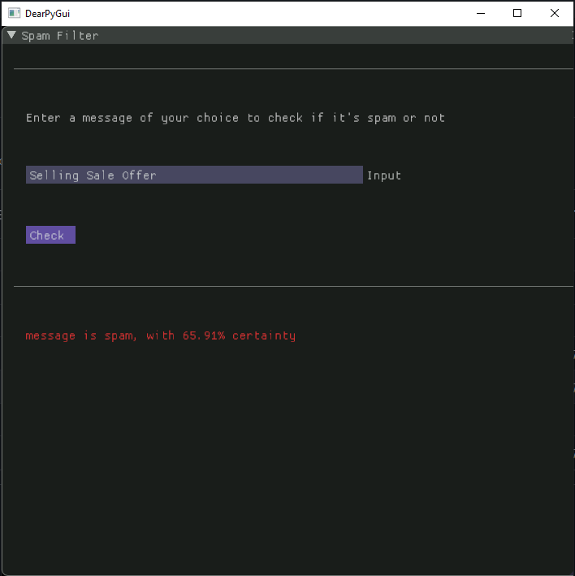

### Spam Filter Desktop Application:
----------
#### Description:
A desktop application, which uses natural language processing to classify input messages into 3 categories using Naive-Bayes Algorithm.
#### ***1.Spam***

#### ***2.Ham***
#### ***3.Not Certain***
