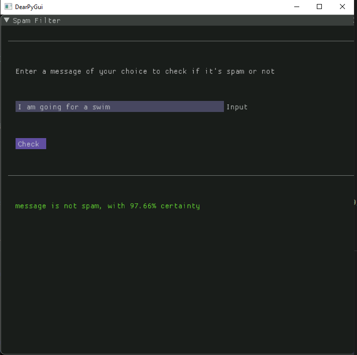

## SpamDee

## Project Description:

Implementation of a Spam Classifier, using Natural Language Processing

## Content's of Project:

#### 1. [Analysis](https://github.com/Sagnik220/SpamDee/tree/main/Analysis)
#### 2. [Desktop Application](https://github.com/Sagnik220/SpamDee/tree/main/Desktop%20App)
#### 3. [Web Application]()

### 1.Desktop Application

#### Dependencies of Desktop Application:
---------
1.DearPyGUI
2.Numpy
3.Pandas
4.Nltk

### About:
#### The desktop application is a python executable file which uses Natural Language Processing, to check if a message is spam or not. Go to the  [Desktop Application](https://github.com/Sagnik220/SpamDee/tree/main/Desktop%20App) for the code!
------

### 2.Web Application

