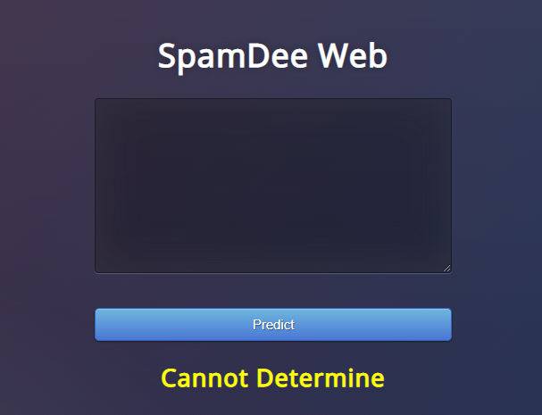

### SpamDee Web Application:
----------
#### Description:
The , which uses natural language processing to classify input messages into 3 categories using Naive-Bayes Algorithm.

#### ***1.Ham***

-----------

#### ***2.Spam***

-----------

#### ***3.Not Certain***

